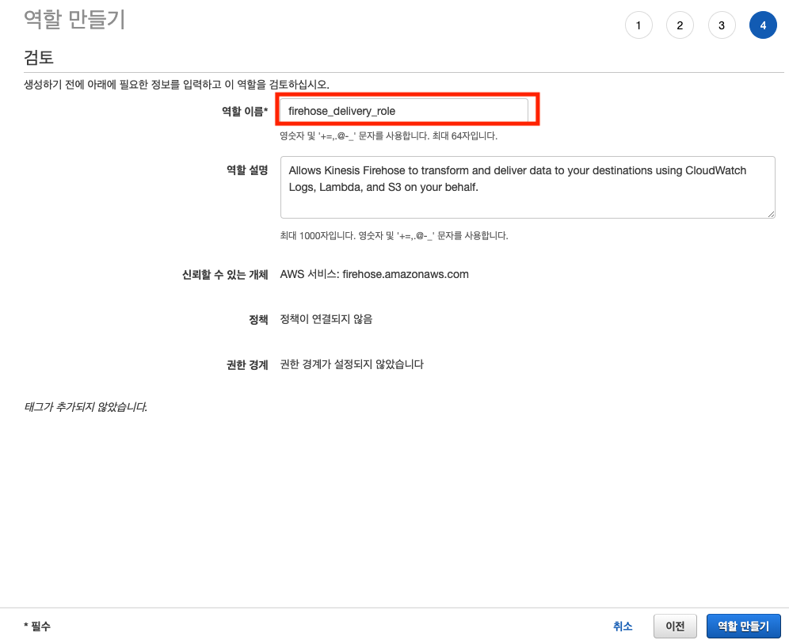
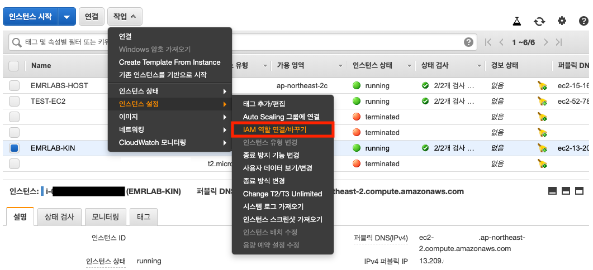

이번 실습에서는 Kinesis Firehose를 이용하여 Amazon S3에 스트림 데이터를 저장하는 것을 배워봅니다. Amazon Kinesis Data Firehose 전송 스트림에 데이터를 전송하는 방법에는 여러가지 방법이 있습니다. 
 
 * Kinesis Data Streams를 이용해 쓰기
 * 에이전트를 이용해 쓰기
 * AWS SDK를 사용하여 쓰기
 * CloudWatch Logs를 이용해 쓰기
 * CloudWatch 이벤트를 이용해 쓰기
 * AWS IoT를 이용해 쓰기

이번 실습에서는 ***에이전트를 이용해 쓰기***를 학습합니다. 나머지 실습은 [공식 문서](https://docs.aws.amazon.com/ko_kr/firehose/latest/dev/basic-write)를 참고해 주십시오.


## Table of Contents

1. 사전 준비
2. Kinesis Firehose delivery streams
3. 데이터 생성하기
4. 데이터 확인하기


# 사전 준비<a name="사전_준비"></a>
---

## EC2에서 Kinesis Firehose 접근 권한

이번 실습에서는 EC2에서 Kinesis Agent를 설치하여 S3에 로그를 저장할 것입니다. 따라서 EC2에서 Kinesis Firehose와 S3에 접근할 IAM role을 생성합니다.

1. IAM 페이지로 이동합니다. [link](https://console.aws.amazon.com/iam/home)
2. 역할을 선택합니다. 
3. 역할 만들기를 선택합니다.

    
---

4. EC2를 선택합니다.

    
---

5. 정책 선택에서 `AmazonS3FullAccess`와 `AmazonKinesisFirehoseFullAccess`를 선택하여 권한을 부여합니다. 

    
---

    
---

6. 태그를 추가하지 않고 다음을 클릭하여 다음 단계로 넘어갑니다. 
7. 역할 이름에 `emrlabs-ec2-kinesis-role`를 입력하고 역할 만들기를 클합니다.

    
---

8. EC2에서 S3와 Kinesis Firehose로 접근할 수 있는 역할이 생성되었습니다.

    
---


## Kinesis Firehose에서 S3 접근 권한

Kinesis Firehose에서 S3에 데이터를 쓰기 위한 권한이 필요합니다. 이 권한을 IAM role로 지정하여 할 수 있습니다.

1. IAM 페이지로 이동합니다. [link](https://console.aws.amazon.com/iam/home)
2. 역할을 선택합니다. 
3. 역할 만들기를 선택합니다.

    
---

4. Kinesis Firehose를 선택합니다.

    
---
    
---

5. 정책 선택에서 아무것도 선택하지 않고 다음을 클릭하여 다음 단계로 넘어갑니다.
6. 태그를 추가하지 않고 다음을 클릭하여 다음 단계로 넘어갑니다. 
7. 역할 이름에 `firehose_delivery_role`를 입력하고 역할 만들기를 클합니다.

    
---

8. Firehose에서 다른 서비스로 접근을 제어할 수 있는 역할이 생성되었습니다.

    
---

## Security Group

이번 실습에서 사용할 EC2에 연결할 Security Group이 필요합니다.

1. EC2 페이지로 이동합니다. [link](https://ap-northeast-2.console.aws.amazon.com/ec2/v2/home?region=ap-northeast-2#Home:)
2. 좌측 네비게이션 메뉴에서 보안 그룹 생성을 클릭합니다.
3. 보안 그룹 생성을 클릭합니다.

    
---

4. `emr-lab-sg`을 입력합니다. VPC는 기본값을 선택합니다.

    
---


# Kinesis Firehose delivery streams<a name="Kinesis Firehose delivery streams"></a>
---

이번 실습에서는 Kinesis Data Firehose 전송 스트림을 생성합니다.

1. Amazon Kinesis 페이지로 이동합니다. [link](https://ap-northeast-2.console.aws.amazon.com/kinesis/home?region=ap-northeast-2#/dashboard)
2. 좌측 네비게이션 메뉴에서 Data Firehose를 클릭합니다.
3. Create delivery stream을 클릭합니다.
4. 딜리버리 스트림의 이름을 `emr-lab-delivery-stream`으로 입력합니다.

    
---

5. Data transformation과 Record format conversion은 `Disabled`로 둡니다

    
---

6. Destination을 Amazon S3로 지정합니다. 버킷명은 Create new를 통해 `id-emr-lab-20200306`로 새로 생성합니다.

    
---

7. 아래 화면을 참고하여 모든 값을 채워넣습니다. Permissions 탭에서 create new or choose를 클릭하여 사전 준비 단계에서 만들었던 firehose_delivery_role에 권한을 부여합니다.  

    
---
    
---

8. 최종 확인 후 delivery stream을 생성합니다.

    
---

## Kinesis Agent 설치하기

Kinesis Firehose에 Log를 전송할 EC2를 생성합니다.

1. EC2 페이지로 이동합니다. [link](https://ap-northeast-2.console.aws.amazon.com/ec2/v2/home?region=ap-northeast-2#Home:)
2. 좌측 네비게이션 메뉴에서 인스턴스를 클릭하고 인스턴스 시작을 클릭합니다.
3. AMI 선택에서 Amazon Linux 2 AMI를 선택합니다. 
4. 인스턴스 유형 선택에서 t2.micro 인스턴스를 클릭합니다. 다음.
5. 태그 추가에서 key: `Name`, value: `EMRLAB-KIN`를 입력합니다.
6. 보안 그룹 구성에서 `기존 보안 그룹 선택`을 클릭하고 앞서 생성한 security group을 `emr-lab-sg`을 선택합니다.
7. 검토 및 시작을 클릭한 후 시작하기를 클릭하고 키 페어를 선택합니다.
8. 인스턴스가 생성될 때까지 기다립니다.


## EC2에서 Kinesis Firehose에 접근하기 위한 IAM role과 연결

EC2에서 Kinesis Firehose delivery stream에 접근하기 위해서는 사전 조건에서 생성한 IAM role과 연결해주어야 합니다.

1. EC2 인스턴스 페이지에서 해당 인스턴스를 클릭합니다.
2. 좌측 상단의 버튼 메뉴에서 작업 -> 인스턴스 설정 -> IAM 역할 연결을 선택합니다.

    
---

3. 사전 조건에서 생성한 역할 `emrlabs-ec2-kinesis-role` 선택합니다.

    
---

## EC2에 에이전트 설치

1. 앞서 생성한 인스턴스에 연결합니다. 아래 그림에서 EC2 인스턴스의 IPv4 퍼블릭 IP 또는 퍼블릭 DNS(IPv4)를 참고하여 아래 명령어의 PUBLIC_DNS 부분에 입력합니다.

    ```
    ssh -i key.pem ec2-user@PUBLIC_DNS
    ```

2. 다음으로, 다음 중 한 가지 방법을 사용하여 인스턴스를 설치합니다.

* Amazon Linux AMI를 이용해 에이전트를 설치하려면 다음 명령을 사용하여 에이전트를 다운로드하고 설치합니다.

    ```
    sudo yum update -y
    sudo yum install –y aws-kinesis-agent
    ```

* Red Hat Enterprise Linux를 사용하여 에이전트를 설치하려면 다음 명령을 사용하여 에이전트를 다운로드하고 설치합니다.

    ```
    sudo yum install –y https://s3.amazonaws.com/streaming-data-agent/aws-kinesis-agent-latest.amz
    ```


## 에이전트 구성 및 시작

구성 파일(/etc/aws-kinesis/agent.json)을 열고 편집합니다(기본 파일 액세스 권한을 사용하는 경우 수퍼유저로).

이 구성 파일에서, 에이전트가 데이터를 수집하는 파일( "filePattern" ), 에이전트가 데이터를 보내는 전송 스트림의 이름( "deliveryStream" )을 지정합니다. 파일 이름은 패턴이며, 에이전트가 파일 로테이션을 인식합니다. 파일을 로테이션하거나 초당 1회 이하 새 파일을 생성할 수 있습니다. 에이전트는 파일 생성 타임스탬프를 사용하여 어떤 파일을 전송 스트림까지 추적할지 결정합니다. 초당 1회보다 자주 새 파일을 생성하거나 파일을 로테이션하면 에이전트가 제대로 구별되지 않습니다.

filePattern에는 수집할 파일의 위치를 지정합니다. 이 랩의 후반부에 데이터를 임의로 생성하여 이 디렉터리에 파일을 생성할 것입니다.

deliveryStream에 앞서 만든 키네시스 딜리버리 스트림의 이름으로 입력합니다.

1. `vi /etc/aws-kinesis/agent.json` 명령어로 구성 파일을 열고 아래와 같이 수정합니다.

    ```
    {
      "cloudwatch.emitMetrics": true,
      "kinesis.endpoint": "",
      "firehose.endpoint": "firehose.ap-northeast-2.amazonaws.com",
    
      "flows": [
        {
          "filePattern": "/tmp/app.log*",
          "deliveryStream": "emr-lab-delivery-stream"
        }
      ]
    }
    ```

2. 에이전트를 수동으로 시작합니다.

    ```
    sudo service aws-kinesis-agent start
    ```

3. (필요하면) 시스템 시작 시 에이전트가 시작되도록 구성합니다.

    ```
    sudo chkconfig aws-kinesis-agent on
    ```

## 데이터 생성하기<a name="데이터 생성하기"></a>

우리는 실제 데이터가 없기 때문에 임의의 데이터를 만들 것입니다. 아래의 소스코드는 임의의 아파치 로그 형태의 데이터를 생성하여 지속적으로 파일을 만듭니다.

연결된 EC2 인스턴스에서 아래와 같이 편집창을 열고 *gen-apache-log.py* 파일을 생성합니다.

```
cd ~
vi gen-apache-log.py
```

소스코드를 입력하고 :wq를 입력하여 파일을 저장합니다.

```
import random
import time
import json
import datetime

responses = [
    "200", "200", "200", "200", "200", "200", "200", "200", "200", "403"
]

f_requests = open('requests_string.txt', 'rb')
requests = f_requests.readlines()
f_requests.close()

inc = 0
while True:
    f = open("/tmp/app.log%s" % inc, 'wb')
    for i in range(0, 10000):
        ip = "%s.%s.%s.%s" % (random.randint(1, 255), random.randint(0, 255), \
            random.randint(0, 255), random.randint(1, 255))
        request = random.choice(requests).replace("\n", "")
        response = random.choice(responses)
        now = datetime.datetime.now()
        timestamp = now.strftime("%d/%b/%Y:%H:%M:%S")
        form = """%s - - [%s] "GET %s HTTP/1.0" %s %s\n"""
        f.write(form % (ip, timestamp, request, response, random.randint(4, 10000)))
        time.sleep(0.01)
    f.close()
    inc += 1
```


```
aws s3 cp s3://public-access-sample-code/requests_string.txt ~/
```

파일을 실행합니다.

```
python gen-apache-log.py
```

# 데이터 확인하기<a name="데이터 확인하기"></a>
---

## S3에서 데이터 확인
앞서 delivery stream에서 지정한 S3 버킷에 위에서 생성한 데이터가 저장되는지 확인합니다. 아래 link를 클릭하여 S3 페이지 이동합니다.
[link](https://s3.console.aws.amazon.com/s3/home?region=ap-northeast-2#)

사전 준비 단계에서 생성한 S3 bucket을 클릭하여 탐색합니다. YYYY/mm/dd/hh 형태로 저장되어 있습니다.


---

## Kinesis Firehose의 delivery stream에서 모니터링하기 

Kinesis Firehose 페이지에서 앞서 만든 delivery stream을 클릭합니다. 모니터링 탭을 누르면 데이터가 들어오는 것을 실시간 모니터링할 수 있습니다.


---

<p align="center">
© 2020 Amazon Web Services, Inc. 또는 자회사, All rights reserved.
</p>

