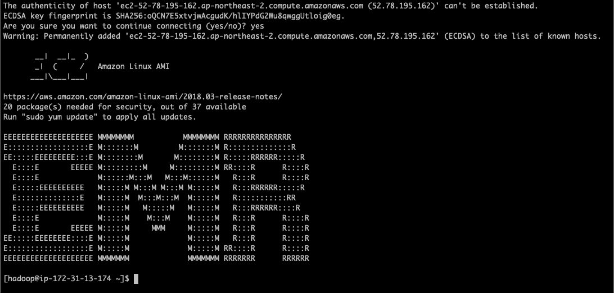

이번 실습은 Adhoc 분석을 실습합니다.

분석에 적합한 데이터를 이용하여 Adhoc 분석을 실습합니다. ***1) SQL 형태의 Hive를 이용한 분석***과 ***2) PySpark를 이용하여 클러스터 프로그래밍***을 경험할 수 있습니다. 

또한 애플리케이션을 모니터링하고 용량을 자동으로 조정하여 최저 가격으로 안정적이고 예측 가능한 성능을 유지할 수 있도록 Auto Scaling을 이용하는 방법을 소개합니다.

## Table of Contents

1. 사전 준비
2. 클러스터 생성
3. Analysis
4. Auto Scaling


# 사전 준비<a name="사전 준비"></a>
---

## S3 버킷 생성

1. Lab 1에서 만들었던 EC2 instance에 연결합니다. 인스턴스는 `EMRLAB-KIN` Name 태그를 가지고 있습니다.

```sh
ssh -i key_file.pem ec2-user@PUBLIC_DNS
```

2. Lab 1에서 우리는 S3 버킷 권한을 부여했습니다. 이 권한이 있으므로 아래 명령어를 통해 버킷을 생성합니다. 버킷은 분석용 데이터를 저장할 버킷입니다. 
*id-* 부분은 본인의 account id로 수정합니다.

```sh
aws s3 mb s3://id-emr-lab-data-20200306
```

## 데이터 다운로드

1. 실습에서 사용할 데이터를 다운로드합니다. 실습은 Kaggle의 [Brazilian E-Commerce Public Dataset by Olist]((https://www.kaggle.com/olistbr/brazilian-ecommerce))를 사용할 것입니다. 
아래 링크를 클릭하여 파일을 다운로드해 주십시오. 데이터는 order와 customer, product등의 데이터가 잘 연결되어 있어서 이번 실습에서 사용하기 적합합니다.
`brazilian-ecommerce` prefix를 만들어서 업로드 하시기 바랍니다.

    [Download](https://www.kaggle.com/olistbr/brazilian-ecommerce/download)


2. 파일 다운로드가 완료되면 압축을 풀고 이전에 생성한 S3의 버킷에 업로드합니다.
실습에서는 order, order_info, product, customer 데이터만 사용할 것입니다.
또한 Hive는 directory 단위로 데이터를 읽습니다. 따라서 각 directory의 역할을 할 수 있도록 prefix를 추가합니다.


    
---

* olist_customers_dataset.csv -> s3://euijj-emr-lab-data-20200307/brazilian-ecommerce/customer/
* olist_products_dataset.csv -> s3://euijj-emr-lab-data-20200307/brazilian-ecommerce/product/
* olist_order_items_dataset.csv -> s3://euijj-emr-lab-data-20200307/brazilian-ecommerce/order/
* olist_orders_dataset.csv -> s3://euijj-emr-lab-data-20200307/brazilian-ecommerce/order_info/

실습에서 사용할 데이터가 준비되었습니다.


# 클러스터 생성<a name="클러스터 생성"></a>
---

이번 단계에서는 Adhoc 분석용 클러스터를 생성합니다.

1. EMR 메인 페이지로 이동합니다. [link](https://ap-northeast-2.console.aws.amazon.com/elasticmapreduce/home?region=ap-northeast-2)

2. Clusters를 선택합니다.

3. Create cluster를 선택합니다.

4. 페이지 상단에 Go to advanced options를 클릭합니다.

    
---

5. Release에 emr 최신 버전을 선택하고, Hive와 Spark를 사용할 것이므로, 기본 선택된 Hadoop와 Hive, Spark, Tez를 선택합니다. 
Lab 4에서 사용할 예정인 Zeppelin도 미리 설치합니다. Next를 눌러 다음 단계로 넘어갑니다.

    
---

6. 이번 실습에서는 Core 노드만 사용합니다. 나머진 그대로 두고, Core 노드에 인스턴스 수를 2로 두고, Task 노드를 X 표시를 눌러 삭제합니다. Core와 Task 노드의 차이는 이 링크를 눌러 확인하시기 바랍니다. [Understanding Master, Core, and Task Nodes](https://docs.aws.amazon.com/emr/latest/ManagementGuide/emr-master-core-task-nodes.html). Next를 눌러 다음 단계로 넘어갑니다.

    
---

7. 클러스터 이름을 `EMR-lab-adhoc-20200306` 으로 넣고 Logging과 Debugging 옵션을 켭니다. Termination protection은 선택 해제 후 Next 를 눌러 다음 단계로 넘어갑니다.

    
---

8. EC2 key pair에 인스턴스에 접속할 key pair를 선택한 후 Create cluster를 선택하여 클러스터를 생성합니다.

    
---

9. 7분 정도 후에 클러스터의 마스터와 Core 노드의 상태가 Running으로 변경될 때까지 기다립니다.

    
---

실습에서 사용할 클러스터의 생성이 완료되었습니다.
	

# Analysis<a name="Analysis"></a>
---

이번 단계에서는 실습을 통해 분석 과정을 경험해 봅니다. 가장 많이 사용되는 어플리케이션인 Hive와 Spark를 사용하여 분석 예시를 살펴보겠습니다.
Hive와 Spark는 아래 설명을 참고하십시오.

* [Apache Hive](https://hive.apache.org/)는 하둡에서 동작하는 데이터 웨어하우스(Data Warehouse) 인프라 구조로서 데이터 요약, 질의 및 분석 기능을 제공합니다. 아파치 하이브는 아파치 HDFS이나 아파치 HBase와 같은 데이터 저장 시스템에 저장되어 있는 대용량 데이터 집합들을 분석할 수 있습니다. HiveQL 이라고 불리는 SQL같은 언어를 제공하며 맵리듀스의 모든 기능을 지원합니다.

* [Apache Spark](https://spark.apache.org/)는 오픈 소스 클러스터 컴퓨팅 프레임워크로, 암시적 데이터 병렬성과 장애 허용과 더불어 완전한 클러스터를 프로그래밍하기 위한 인터페이스를 제공합니다.

Hive와 Spark를 실행하기 위해 Master Node에 연결합니다. 
EC2 인스턴스의 Security Group에 ssh 연결을 위해 22 포트를 inbound rules로 추가한 것처럼, ElasticMapReduce-master Security Group에도 동일하게 22 포트를 추가해 줍니다.
ssh 연결은 EC2 인스턴스에 연결하는 것과 동일합니다. EMR_PUBLIC_DNS는 EMR 클러스터의 **Master public DNS**입니다. user name에 **hadoop**을 작성하는 것에 유의하십시오.


```sh
ssh -i key_file.pem hadoop@EMR_PUBLIC_DNS
```

정상적으로 연결되면 아래와 같은 화면이 보입니다.


---

## Hive


Hive를 이용하여 SQL과 같은 분석 쿼리를 실습할 수 있습니다.

* `hive`를 입력하여 Hive를 실행합니다.


---

1. HDFS에 저장된 데이터를 Hive로 가지고 와서 테이블을 생성합니다.

```sql
CREATE EXTERNAL TABLE IF NOT EXISTS orders (
order_id                   STRING,
order_item_id              STRING,
product_id                 STRING,
seller_id                  STRING,
shipping_limit_date        DATE,
price                      DOUBLE,
freight_value              DOUBLE
)
ROW FORMAT DELIMITED
FIELDS TERMINATED BY ','
LOCATION 's3://id-emr-lab-data-20200306/brazilian-ecommerce/order/';

CREATE EXTERNAL TABLE IF NOT EXISTS product (
product_id                  STRING,
product_category_name       STRING,
product_name_lenght         int,
product_description_lenght  int,
product_photos_qty          int,
product_weight_g            int,
product_length_cm           int,
product_height_cm           int,
product_width_cm            int
)
ROW FORMAT DELIMITED
FIELDS TERMINATED BY ','
location 's3://id-emr-lab-data-20200306/brazilian-ecommerce/product/';

CREATE EXTERNAL TABLE IF NOT EXISTS order_info (
order_id                       STRING,
customer_id                    STRING,
order_status                   STRING,
order_purchase_timestamp       STRING,
order_approved_at              STRING,
order_delivered_carrier_date   STRING,
order_delivered_customer_date  STRING,
order_estimated_delivery_date  STRING
)
ROW FORMAT DELIMITED
FIELDS TERMINATED BY ','
LOCATION 's3://id-emr-lab-data-20200306/brazilian-ecommerce/order_info/';
```

2. Product Category별 구매 금액 Sum, Avg을 구하고 저장하는 쿼리를 작성합니다.

```sql
CREATE TABLE IF NOT EXISTS category_price_sum_avg AS
SELECT P.product_category_name, SUM(O.price) AS sum_price, AVG(O.price) AS avg_price
FROM orders O
JOIN product P ON (O.product_id = P.product_id)
GROUP BY P.product_category_name
ORDER BY avg_price DESC;

INSERT OVERWRITE DIRECTORY 's3://id-emr-lab-data-20200306/brazilian-ecommerce/category_price_sum_avg'
ROW FORMAT DELIMITED
FIELDS TERMINATED BY ','
STORED AS TEXTFILE 
SELECT * from category_price_sum_avg;
```

3. 각 User별 구매 금액 Sum을 구하고 저장하는 쿼리를 작성합니다.

```sql
CREATE TABLE IF NOT EXISTS customer_total_purchase AS
SELECT I.customer_id, SUM(O.price) AS sum_purchase
FROM orders O
JOIN order_info I ON (O.order_id = I.order_id)
GROUP BY I.customer_id 
ORDER BY sum_purchase DESC;

INSERT OVERWRITE DIRECTORY 's3://id-emr-lab-data-20200306/brazilian-ecommerce/customer_total_purchase'
ROW FORMAT DELIMITED
FIELDS TERMINATED BY ','
STORED AS TEXTFILE 
SELECT * from customer_total_purchase;
```


## PySpark


이번에는 PySpark를 이용하여 파이썬 랭귀지로 클러스터 프로그래밍을 연습해 보겠습니다.

* EMR 마스터 노드에 연결된 상태에서 `pyspark`를 입력하여 PySpark를 실행합니다.


---

1. PySpark는 프로그래밍이 가능하여 제한적인 SQL보다 더 다양하고 복잡한 작업을 가능하게 합니다. 여기서는 Kinesis에서 저장한 log의 의미있는 부분만 추출하여 저장합니다. 

```python
import pyspark.sql.functions as f

# 파티션드 데이터 로딩 2020/03/*/* 하면 3월 데이터 모두, 2020/03/02/* 하면 3월 2일 데이터 모두
log_raw = spark.read.format('com.databricks.spark.csv') \
  .options(header='false', inferschema='true') \
  .option("delimiter", "\t") \
  .load("id-emr-lab-20200306/2020/03/*/*") \
  .cache()

splitter = f.split(log_raw['_c0'], ' - - |\"')
log_raw = log_raw.withColumn('ip', splitter.getItem(0))
log_raw = log_raw.withColumn('timestamp', splitter.getItem(1))
log_raw = log_raw.withColumn('request', splitter.getItem(2))
log_raw = log_raw.withColumn('response_code', splitter.getItem(3))

splitter = pyspark.sql.functions.split(log_raw['response_code'], ' ')
log_raw = log_raw.withColumn('status', splitter.getItem(1))
log = log_raw.drop('_c0')

log.show(20, False)

# status가 200인 개수와 200이 아닌 경우의 개수를 세어봅니다.
log.filter(log_raw.status == 200).count()
log.filter(log_raw.status != 200).count()

# 테이블로 정제한 데이터를 저장합니다.
# 테이블로 정제한 데이터를 S3에 저장합니다.
log.repartition(1) \
  .write.mode('overwrite') \
  .csv('s3://id-emr-lab-data-20200306/brazilian-ecommerce/apachelog')
```

2. SQL 형태의 분석도 가능합니다. 앞서 Hive에서 추출한 데이터로부터 도시별 구매 금액과 평균과 합계를 확인합니다.

```python
import pyspark.sql.functions as f
customer = spark.read.format('com.databricks.spark.csv') \
  .options(header='true', inferschema='true') \
  .option("delimiter", ",") \
  .load("s3://id-emr-lab-data-20200306/brazilian-ecommerce/customer/") \
  .cache()

customer_total_purchase = spark.read.format('com.databricks.spark.csv') \
  .options(header='false', inferschema='true') \
  .option("delimiter", ",") \
  .load("s3://id-emr-lab-data-20200306/brazilian-ecommerce/customer_total_purchase") \
  .cache()

# 조인
customer_info = customer.join(customer_total_purchase,
                            customer.customer_id == customer_total_purchase._c0, how="inner")

# 각 city별 거래 금액 SUM AVG
city_purchase = customer_info.groupBy(customer_info.customer_city) \
  .agg(f.sum(customer_info._c1), f.avg(customer_info._c1))

# 결과 데이터를 S3에 저장합니다.
city_purchase.repartition(1) \
  .write.mode('overwrite') \
  .csv('s3://id-emr-lab-data-20200306/brazilian-ecommerce/city_purchase')
```


# EMR Auto Scaling<a name="EMR Auto Scaling"></a>
---

이번 단계에서는 분석 작업이 많아졌을 때 클러스터를 자동으로 확장하는 방법에 대해 배워봅니다.

1. EMR 메인 페이지로 이동합니다. [link](https://ap-northeast-2.console.aws.amazon.com/elasticmapreduce/home?region=ap-northeast-2)

2. Clusters를 선택합니다. 

3. 실습에서 생성했던 `EMR-lab-adhoc-20200306` 클러스터를 선택합니다.

4. Hardware 탭을 선택합니다.

5. Auto Scaling 탭의 Not enabled 옆의 수정 아이콘을 클릭합니다.

    
---

6. 아래 스크린샷을 참고하여 값을 채워 넣습니다. 모든 값이 정확하게 입력되었는지 확인한 후 Modify를 클릭하여 적용합니다. 

    
---

    * Scale out
        * YARNMemoryAvailablePercentage가 20보다 작은 현상이 5분 간격으로 3번 관찰되었을 때 2개의 인스턴스를 추가합니다.
        * ContainerPendingRatio가 0.75보다 큰 현상이 5분 간격으로 3번 관찰되었을 때 2개의 인스턴스를 추가합니다.

    * Scale in
        * YARNMemoryAvailablePercentage가 85보다 큰 현상이 5분 간격으로 3번 관찰되었을 때 1개의 인스턴스를 종료합니다.

    * YARNMemoryAvailablePercentage와 ContainerPendingRatio는 아래 설명을 참조하십시오.
        * YarnMemoryAvailablePercentage: YARN에서 사용할 수 있는 잔여 메모리 비율입니다.
        * ContainerPendingRatio: 대기 중인 컨테이너/할당된 컨테이너 입니다. 이 측정치를 사용하여 다양한 로드에 대한 할당 컨테이너 동작을 기반으로 클러스터를 조정할 수 있으며, 이는 성능 튜닝에 유용합니다.

7. Auto Scaling 상태가 Pending에서 Attached가 될 때까지 기다립니다.

    
---

8. 앞서 실험한 분석 예시를 여러 개의 쉘을 띄우고 동시에 실행해 봅니다. 여러 개의 분석 작업이 동시에 실행되면 YARN에서 사용할 수 있는 잔여 메모리의 비율이 감소하고, 대기 중인 컨테이너가 증가하여, 오토 스케일링 기능이 동작하는 것을 확인할 수 있습니다.

<p align="center">
© 2020 Amazon Web Services, Inc. 또는 자회사, All rights reserved.
</p>