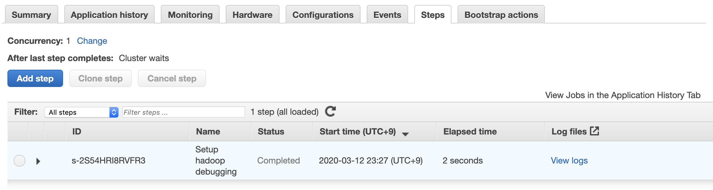
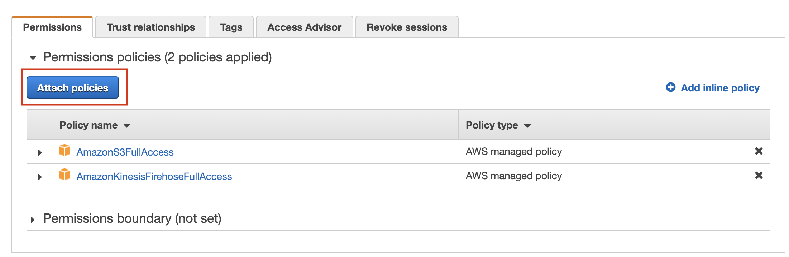
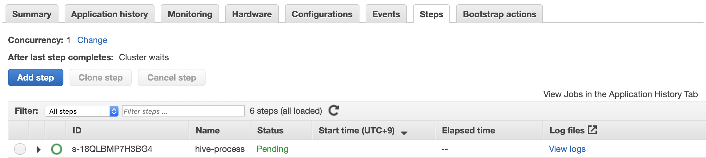
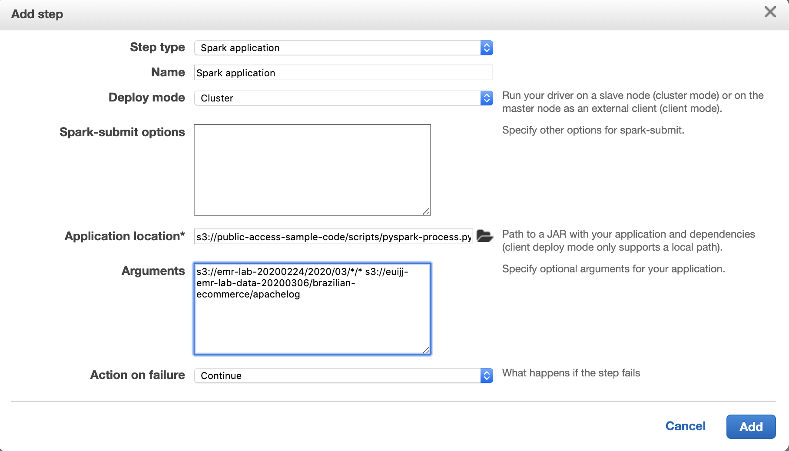
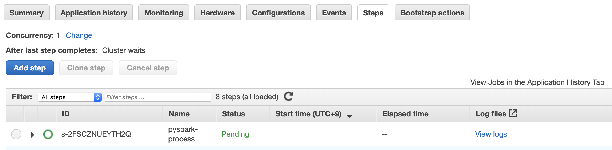
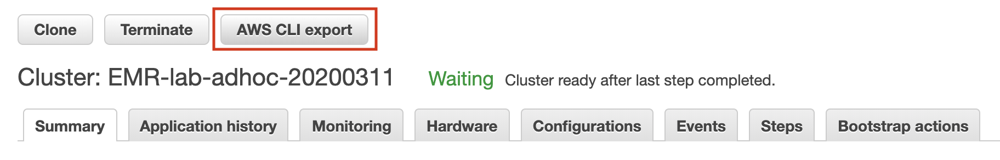
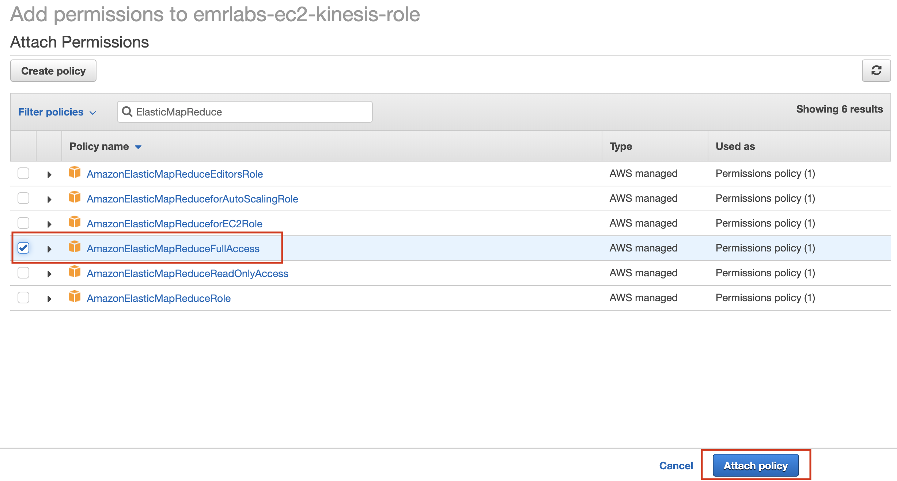

이번 실습에서는 ***EMR Hands-On Lab 2 - Adhoc on EMR*** 에서 진행했던 데이터 분석 작업들을 자동화하여 반복적으로 실행하는 작업으로 만듭니다.

앞서 실습에서 수행했던 데이터 처리 작업은 아래와 같습니다.

1. Product Category별 구매 금액 Sum, Avg을 계산합니다.
2. 각 User별 구매 금액 Sum을 계산합니다.
3. Kinesis에서 저장한 log의 의미있는 부분을 추출합니다.
4. 앞서 Hive에서 추출한 데이터로부터 도시별 구매 금액과 평균과 합계를 계산합니다.

이 데이터의 트랜드를 보려면 매일 이 데이터를 뽑아야 합니다. 이렇게 반복되는 작업을 자동화할 때는 EMR의 Step을 이용할 수 있습니다.
여기서는 데이터 처리 작업을 Daily Batch로 실행할 수 있도록 만들어 보겠습니다.
각 데이터 처리 작업은 EMR Step으로 등록하여 모든 Step이 종료되면 Cluster를 종료합니다.
이렇게 하면 불필요한 리소스 사용을 방지할 수 있어 운영 효율성이 증가합니다.

## Table of Contents

1. EMR Steps
2. AWS CLI export
3. Cronjob


# EMR Steps<a name="EMR Steps"></a>
---

클러스터에 작업을 제출하는 방식은 여러가지가 있습니다. 우리는 지금까지 Master node에 연결하여 Interactive하게 쿼리하고 프로그래밍하는 내용을 다루었습니다.

이 단원에서는 Step을 이용하여 Amazon EMR 클러스터에 작업을 제출하는 방법을 설명합니다. 
Step을 추가하거나 하둡 작업을 마스터 노드에 대화형으로 제출하여 클러스터에 작업을 제출할 수 있습니다. 

그리고 클러스터에 제출된 Step이 모두 종료되면 클러스터를 종료하여 자원을 효율적으로 사용하는 방법을 알아봅니다.

## 스크립트 만들기

1. Hive에서 작업했던 쿼리들을 스크립트로 만듭니다. `hive-process.q` 파일을 생성하여 이전에 실행했던 쿼리를 입력합니다. 
입력 데이터와 출력 데이터의 위치나 prefix는 바뀔 수 있으므로 INPUT과 OUTPUT을 파라미터로 받을 수 있도록 쿼리를 수정합니다.

    ```sql
    CREATE EXTERNAL TABLE IF NOT EXISTS orders (
      order_id                   STRING,
      order_item_id              STRING,
      product_id                 STRING,
      seller_id                  STRING,
      shipping_limit_date        DATE,
      price                      DOUBLE,
      freight_value              DOUBLE
    )
    ROW FORMAT DELIMITED
    FIELDS TERMINATED BY ','
    LOCATION '${INPUT}/order/';

    CREATE EXTERNAL TABLE IF NOT EXISTS product (
      product_id                  STRING,
      product_category_name       STRING,
      product_name_lenght         int,
      product_description_lenght  int,
      product_photos_qty          int,
      product_weight_g            int,
      product_length_cm           int,
      product_height_cm           int,
      product_width_cm            int
    )
    ROW FORMAT DELIMITED
    FIELDS TERMINATED BY ','
    LOCATION '${INPUT}/product/';

    CREATE TABLE IF NOT EXISTS category_price_sum_avg AS
    SELECT P.product_category_name, SUM(O.price) AS sum_price, AVG(O.price) AS avg_price
    FROM orders O
    JOIN product P ON (O.product_id = P.product_id)
    GROUP BY P.product_category_name
    ORDER BY avg_price DESC;

    INSERT OVERWRITE DIRECTORY '${OUTPUT}/category_price_sum_avg'
    ROW FORMAT DELIMITED
    FIELDS TERMINATED BY ','
    STORED AS TEXTFILE 
    SELECT * from category_price_sum_avg;
    ```

2. PySpark에서 작업했던 코드를 python 스크립트로 만듭니다. `pyspark-process.py` 파일을 생성하여 아래의 코드를 입력합니다.
데이터 처리 코드는 동일하지만, Spark와 연결하기 위한 코드 몇줄이 추가되었습니다. 마찬가지로 입력, 출력 위치를 동적으로 바꿀 수 있도록 코드를 약간 수정합니다.

    ```python
    import pyspark
    from pyspark.sql import SparkSession
    import pyspark.sql.functions as f
    import sys

    input = sys.argv[1]
    output = sys.argv[2]

    spark = SparkSession \
        .builder \
        .appName("Python Spark SQL basic example") \
        .config("spark.some.config.option", "some-value") \
        .getOrCreate()

    log_raw = spark.read.format('com.databricks.spark.csv') \
        .options(header='false', inferschema='true') \
        .option("delimiter", "\t") \
        .load(input) \
        .cache()

    splitter = pyspark.sql.functions.split(log_raw['_c0'], ' - - |\"')
    log_raw = log_raw.withColumn('ip', splitter.getItem(0))
    log_raw = log_raw.withColumn('timestamp', splitter.getItem(1))
    log_raw = log_raw.withColumn('request', splitter.getItem(2))
    log_raw = log_raw.withColumn('response_code', splitter.getItem(3))

    splitter = pyspark.sql.functions.split(log_raw['response_code'], ' ')
    log_raw = log_raw.withColumn('status', splitter.getItem(1))
    log = log_raw.drop('_c0')

    log.repartition(1) \
        .write.mode('overwrite') \
        .csv(output)
    ```

3. 위 스크립트 파일들을 S3에 업로드합니다.
파일을 적절한 버킷에 얿로드하거나, 버킷이 없으면 새로 생성하여 업로드합니다.

    ```sh
    aws s3 cp hive-process.q s3://bucketname/
    aws s3 cp pyspark-process.py s3://bucketname/
    ```

## Steps 동작 테스트

1. EMR 메인 페이지로 이동합니다. [link](https://ap-northeast-2.console.aws.amazon.com/elasticmapreduce/home?region=ap-northeast-2)

2. Lab 2에서 생성했던 `EMR-lab-adhoc-20200306`를 선택합니다.

3. Steps 탭으로 이동합니다. Add step을 클릭하여 스텝을 추가합니다.

    
---

4. 아래 값을 참조하여 Hive program을 추가합니다.

    
---

    ```
    Step type: Hive program
    Name: hive-process
    Script S3 location: s3://bucketname/scripts/hive-process.q
    Input S3 location: s3://id-emr-lab-data-20200306/brazilian-ecommerce/
    Output S3 location: s3://id-emr-lab-data-20200306/brazilian-ecommerce/
    Action on failure: Continue
    ```

5. Pending에서 Complete가 될 때까지 기다립니다. 
Complete가 되었다면 데이터를 확인하여 결과물이 잘 나왔는지 확인합니다.

    
---

6. 이번에는 아래 값을 참조하여 PySpark 작업을 Step으로 추가합니다.

    
---

    ```
    Step type: Spark application
    Name: pyspark-process
    Deploy mode: Cluster
    Application location: s3://bucketname/scripts/pyspark-process.py
    Arguments: s3://emr-lab-20200303/2020/03/*/* s3://id-emr-lab-data-20200306/brazilian-ecommerce/apachelog/
    Action on failure: Continue
    ```

7. Pending에서 Complete가 될 때까지 기다립니다. 
Complete가 되었다면 데이터를 확인하여 결과물이 잘 나왔는지 확인합니다.

    
---

# AWS CLI export<a name="AWS CLI"></a>
---

앞서 작업한 Adhoc 분석용 클러스터와 동일한 설정의 클러스터를 만들 수 있습니다.

1. EMR 메인 페이지로 이동합니다. [link](https://ap-northeast-2.console.aws.amazon.com/elasticmapreduce/home?region=ap-northeast-2)

2. Adhoc Clusters를 선택합니다.

3. AWS CLI export를 클릭합니다.

    
---

4. 화면에 출력된 Cli 문자열을 복사하여 따로 저장해 둡니다. 아래와 같은 형태가 되어야 합니다. 이 CLI를 호출하면 동일한 설정의 클러스터가 생성됩니다. 
Parameter에 대한 자세한 설명은 [aws emr cli](https://docs.aws.amazon.com/cli/latest/reference/emr/index.html) Reference 공식 문서를 참조해 주시기 바랍니다.

    ```
    aws emr create-cluster \
    --auto-scaling-role EMR_AutoScaling_DefaultRole \
    --applications Name=Hadoop Name=Hive Name=Spark Name=Tez Name=Zeppelin \
    --ebs-root-volume-size 10 \
    --ec2-attributes '{"KeyName":"key","InstanceProfile":"EMR_EC2_DefaultRole","SubnetId":"subnet-xxxx","EmrManagedSlaveSecurityGroup":"sg-xxxx","EmrManagedMasterSecurityGroup":"sg-xxxx"}' \
    --service-role EMR_DefaultRole \
    --enable-debugging \
    --release-label emr-5.29.0 \
    --log-uri 's3n://aws-logs-xxxx-ap-northeast-2/elasticmapreduce/' \
    --steps '[{"Args":["hive-script","--run-hive-script","--args","-f","s3://public-access-sample-code/scripts/hive-process.q"],"Type":"CUSTOM_JAR","ActionOnFailure":"CONTINUE","Jar":"command-runner.jar","Properties":"","Name":"hive-process"}, {"Args":["spark-submit","--deploy-mode","cluster","s3://public-access-sample-code/scripts/pyspark-process.py","s3://emr-lab-20200224/2020/03/*/*","s3://euijj-emr-lab-data-20200306/brazilian-ecommerce/apachelog/"],"Type":"CUSTOM_JAR","ActionOnFailure":"CONTINUE","Jar":"command-runner.jar","Properties":"","Name":"pyspark-process"}]' \
    --name 'EMR-lab-adhoc-20200306' \
    --instance-groups '[{"InstanceCount":1,"InstanceGroupType":"MASTER","InstanceType":"r3.xlarge","Name":"Master - 1"},{"InstanceCount":3,"InstanceGroupType":"CORE","InstanceType":"r3.xlarge","Name":"Core - 2"}]' \
    --scale-down-behavior TERMINATE_AT_TASK_COMPLETION \
    --region ap-northeast-2
    ```

* 위 CLI에 --auto-terminate 옵션을 추가하면 모든 Step이 완료된 후 클러스터를 자동으로 종료하도록 지정할 수 있습니다.
이 부분을 수정한 최종 버전 CLI는 아래와 같습니다.

    ```
    aws emr create-cluster \
    --auto-scaling-role EMR_AutoScaling_DefaultRole \
    --applications Name=Hadoop Name=Hive Name=Spark Name=Tez Name=Zeppelin \
    --ebs-root-volume-size 10 \
    --ec2-attributes '{"KeyName":"key","InstanceProfile":"EMR_EC2_DefaultRole","SubnetId":"subnet-xxxx","EmrManagedSlaveSecurityGroup":"sg-xxxx","EmrManagedMasterSecurityGroup":"sg-xxxx"}' \
    --service-role EMR_DefaultRole \
    --enable-debugging \
    --release-label emr-5.29.0 \
    --log-uri 's3n://aws-logs-xxxx-ap-northeast-2/elasticmapreduce/' \
    --steps '[{"Args":["hive-script","--run-hive-script","--args","-f","s3://public-access-sample-code/scripts/hive-process.q"],"Type":"CUSTOM_JAR","ActionOnFailure":"CONTINUE","Jar":"command-runner.jar","Properties":"","Name":"hive-process"}, {"Args":["spark-submit","--deploy-mode","cluster","s3://public-access-sample-code/scripts/pyspark-process.py","s3://emr-lab-20200224/2020/03/*/*","s3://euijj-emr-lab-data-20200306/brazilian-ecommerce/apachelog/"],"Type":"CUSTOM_JAR","ActionOnFailure":"CONTINUE","Jar":"command-runner.jar","Properties":"","Name":"pyspark-process"}]' \
    --name 'EMR-lab-adhoc-20200306' \
    --instance-groups '[{"InstanceCount":1,"InstanceGroupType":"MASTER","InstanceType":"r3.xlarge","Name":"Master - 1"},{"InstanceCount":3,"InstanceGroupType":"CORE","InstanceType":"r3.xlarge","Name":"Core - 2"}]' \
    --scale-down-behavior TERMINATE_AT_TASK_COMPLETION \
    --region ap-northeast-2 \
    --auto-terminate
    ```

# Cronjob<a name="Cronjob"></a>
---

## EC2에 EMR 생성 권한 부여하기

이번 실습에서는 위에서 완성한 AWS Cli를 Cronjob과 같은 도구를 이용하여 반복적으로 생성하는 방법을 알아봅니다.

***EMR Hands-On Lab 1*** 에서 생성했던 EC2 instance에서 실행할 것입니다.

그러나 EC2 instance는 EMR 클러스터를 실행하기 위한 권한이 필요합니다. EC2 instance에 기존에 Attache한 IAM 롤을 이용하여 권한을 추가해야 합니다.

1. IAM 페이지로 이동합니다. [link](https://console.aws.amazon.com/iam/home)

2. 역할을 선택합니다. 

3. 검색창에 `emrlabs-ec2-kinesis-role` 을 입력하여 emrlabs-ec2-kinesis-role을 선택합니다.

4. Permission 탭에서 Attach policy를 클릭합니다.

    
---

5. 검색창에 ElasticMapReduce를 입력하여 `AmazonElasticMapReduceFullAccess` 선택하고 Attach를 클릭합니다.

    
---

6. 이제 해당 EC2 instance에서 EMR API 권한이 부여되었습니다.


## Cronjob

1. ***EMR Hands-On Lab 1*** 에서 생성했던 EC2 instance에 연결합니다.

    ```
    ssh -i key.pem ec2-user@PUBLIC_DNS
    ```

2. `vi ~/run_emr_cli.sh` 명령어를 입력하여 run_emr_cli.sh 파일을 생성합니다.  

    ```
    aws emr create-cluster \
    --auto-scaling-role EMR_AutoScaling_DefaultRole \
    --applications Name=Hadoop Name=Hive Name=Spark Name=Tez Name=Zeppelin \
    --ebs-root-volume-size 10 \
    --ec2-attributes '{"KeyName":"key","InstanceProfile":"EMR_EC2_DefaultRole","SubnetId":"subnet-xxxx","EmrManagedSlaveSecurityGroup":"sg-xxxx","EmrManagedMasterSecurityGroup":"sg-xxxx"}' \
    --service-role EMR_DefaultRole \
    --enable-debugging \
    --release-label emr-5.29.0 \
    --log-uri 's3n://aws-logs-xxxx-ap-northeast-2/elasticmapreduce/' \
    --steps '[{"Args":["hive-script","--run-hive-script","--args","-f","s3://public-access-sample-code/scripts/hive-process.q","-d","OUTPUT=s3://euijj-emr-lab-data-20200306/brazilian-ecommerce/category_price_sum_avg/"],"Type":"CUSTOM_JAR","ActionOnFailure":"CONTINUE","Jar":"command-runner.jar","Properties":"","Name":"hive-process"}, {"Args":["spark-submit","--deploy-mode","cluster","s3://public-access-sample-code/scripts/pyspark-process.py","s3://emr-lab-20200224/2020/03/*/*","s3://euijj-emr-lab-data-20200306/brazilian-ecommerce/apachelog/"],"Type":"CUSTOM_JAR","ActionOnFailure":"CONTINUE","Jar":"command-runner.jar","Properties":"","Name":"pyspark-process"}]' \
    --name 'EMR-lab-adhoc-20200306' \
    --instance-groups '[{"InstanceCount":1,"InstanceGroupType":"MASTER","InstanceType":"r3.xlarge","Name":"Master - 1"},{"InstanceCount":3,"InstanceGroupType":"CORE","InstanceType":"r3.xlarge","Name":"Core - 2"}]' \
    --scale-down-behavior TERMINATE_AT_TASK_COMPLETION \
    --region ap-northeast-2 \
    --auto-terminate
    ```

3. 스크립트 파일에 실행 권한을 부여합니다.

    ```
    chmod 755 ~/run_emr_cli.sh
    ```

4. 테스트를 위해 한번 실행해 보시기 바랍니다. 명령어 실행 후 [EMR 페이지](https://ap-northeast-2.console.aws.amazon.com/elasticmapreduce/home?region=ap-northeast-2)에서 확인해 보시면 Cluster가 생성된 것을 확인할 수 있습니다.

    ```
    ~/run_emr_cli.sh
    ```

5. 아래 명령어를 통해 cronjob을 편집합니다.

    ```
    crontab -e
    ```
    
6. 편집기에서 run_emr_cli.sh 파일 위치를 입력합니다. 실행을 원하는 시간을 등록합니다. cronjob 스케줄링은 이 [link](https://crontab.guru/)를 참조해 주십시오.

    ```
    # Example of job definition:
    # .---------------- minute (0 - 59)
    # |  .------------- hour (0 - 23)
    # |  |  .---------- day of month (1 - 31)
    # |  |  |  .------- month (1 - 12) OR jan,feb,mar,apr ...
    # |  |  |  |  .---- day of week (0 - 6) (Sunday=0 or 7) OR sun,mon,tue,wed,thu,fri,sat
    # |  |  |  |  |
    # *  *  *  *  * command to be executed
      0  9  *  *  * ~/run_emr_cli.sh
    ```

7. 매일 오전 9시마다 앞서 작성했던 AWS Cli를 호출하는 프로그램 작성이 완료되었습니다.
    

<p align="center">
© 2020 Amazon Web Services, Inc. 또는 자회사, All rights reserved.
</p>