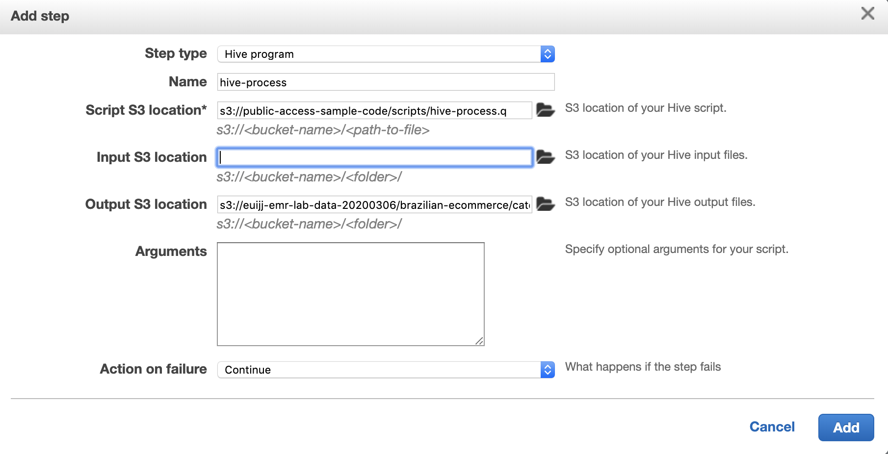

이번 실습에서는 ***EMR Hands-On Lab 2 - Adhoc on EMR*** 에서 진행했던 데이터 분석 작업들을 자동화하여 반복적으로 실행하는 작업으로 만듭니다.

앞서 실습에서 수행했던 데이터 처리 작업은 아래와 같습니다.

1. Product Category별 구매 금액 Sum, Avg을 계산합니다.
2. 각 User별 구매 금액 Sum을 계산합니다.
3. Kinesis에서 저장한 log의 의미있는 부분을 추출합니다.
4. 앞서 Hive에서 추출한 데이터로부터 도시별 구매 금액과 평균과 합계를 계산합니다.

이 데이터의 트랜드를 보려면 매일 이 데이터를 뽑아야 합니다. 이렇게 반복되는 작업을 자동화할 때는 EMR의 Step을 이용할 수 있습니다.
여기서는 데이터 처리 작업을 Daily Batch로 실행할 수 있도록 만들어 보겠습니다.
각 데이터 처리 작업은 EMR Step으로 등록하여 모든 Step이 종료되면 Cluster를 종료합니다.
이렇게 하면 불필요한 리소스 사용을 방지할 수 있어 운영 효율성이 증가합니다.

## Table of Contents

1. AWS CLI
2. EMR Steps
3. Cronjob


## AWS CLI<a name="AWS CLI"></a>


앞서 작업한 Adhoc 분석용 클러스터와 동일한 설정의 클러스터를 만들 수 있습니다.

1. EMR 메인 페이지로 이동합니다. [link]()
2. Adhoc Clusters를 선택합니다.
3. AWS CLI export를 클릭합니다.

    
---

4. 화면에 출력된 Cli 문자열을 복사하여 따로 저장해 둡니다. 아래와 같은 형태가 되어야 합니다. 이 CLI를 호출하면 동일한 설정의 클러스터가 생성됩니다. 
Parameter에 대한 자세한 설명은 [aws emr cli](https://docs.aws.amazon.com/cli/latest/reference/emr/index.html) Reference 공식 문서를 참조해 주시기 바랍니다.

    ```
    aws emr create-cluster \
        --auto-scaling-role EMR_AutoScaling_DefaultRole \
        --applications Name=Hadoop Name=Hive Name=Spark Name=Tez \
        --ebs-root-volume-size 10 \
        --ec2-attributes '{"KeyName":"key","InstanceProfile":"EMR_EC2_DefaultRole", \
            "SubnetId":"subnet-xxxx","EmrManagedSlaveSecurityGroup":"sg-xxxx", \
            "EmrManagedMasterSecurityGroup":"sg-xxxx"}' \
        --service-role EMR_DefaultRole \
        --enable-debugging --release-label emr-5.29.0 \
        --log-uri 's3n://aws-logs-xxxx-ap-northeast-2/elasticmapreduce/' \
        --name 'EMR-lab-adhoc-20200311' \
        --instance-groups '[{"InstanceCount":1,"InstanceGroupType":"MASTER", \
            "InstanceType":"r3.xlarge","Name":"Master - 1"}, \
            {"InstanceCount":4,"InstanceGroupType":"CORE", \
            "InstanceType":"r3.xlarge","Name":"Core - 2"}]' \
        --scale-down-behavior TERMINATE_AT_TASK_COMPLETION \
        --region ap-northeast-2
    ```

## EMR Steps<a name="EMR Steps"></a>


Step을 추가할 수 있습니다.

Hive에서 


## Cronjob<a name="Cronjob"></a>


### EC2에 EMR 생성 권한 부여하기

이번 실습에서는 위에서 완성한 AWS Cli를 Cronjob과 같은 도구를 이용하여 반복적으로 실행하는 방법을 알아봅니다.

***EMR Hands-On Lab 1*** 에서 생성했던 EC2 instance에서 실행할 것입니다.

그러나 EC2 instance는 EMR 클러스터를 실행하기 위한 권한이 필요합니다. EC2 instance에 기존에 Attache한 IAM 롤을 이용하여 권한을 추가해야 합니다.

1. IAM 페이지로 이동합니다. [link](https://console.aws.amazon.com/iam/home)
2. 역할을 선택합니다. 
3. 검색창에 `emrlabs-ec2-kinesis-role` 을 입력하여 emrlabs-ec2-kinesis-role을 선택합니다.
4. Permission 탭에서 Attach policy를 클릭합니다.

    
---
    
5. 검색창에 ElasticMapReduce를 입력하여 `AmazonElasticMapReduceFullAccess` 선택하고 Attach를 클릭합니다.

    
---

6. 이제 해당 EC2 instance에서 EMR API 권한이 부여되었습니다.


### Cronjob

1. ***EMR Hands-On Lab 1*** 에서 생성했던 EC2 instance에 연결합니다.

    ```
    ssh -i ~/WorkDocs/dev/key/euijj.pem ec2-user@PUBLIC_DNS
    ```

2. `vi ~/run_emr_cli.sh` 명령어를 입력하여 run_emr_cli.sh 파일을 생성합니다.  

    ```
    aws emr create-cluster \
        --auto-scaling-role EMR_AutoScaling_DefaultRole \
        --applications Name=Hadoop Name=Hive Name=Spark Name=Tez \
        --ebs-root-volume-size 10 \
        --ec2-attributes '{"KeyName":"key","InstanceProfile":"EMR_EC2_DefaultRole", \
            "SubnetId":"subnet-xxxx","EmrManagedSlaveSecurityGroup":"sg-xxxx", \
            "EmrManagedMasterSecurityGroup":"sg-xxxx"}' \
        --service-role EMR_DefaultRole \
        --enable-debugging --release-label emr-5.29.0 \
        --log-uri 's3n://aws-logs-xxxx-ap-northeast-2/elasticmapreduce/' \
        --name 'EMR-lab-adhoc-20200311' \
        --instance-groups '[{"InstanceCount":1,"InstanceGroupType":"MASTER", \
            "InstanceType":"r3.xlarge","Name":"Master - 1"}, \
            {"InstanceCount":4,"InstanceGroupType":"CORE", \
            "InstanceType":"r3.xlarge","Name":"Core - 2"}]' \
        --scale-down-behavior TERMINATE_AT_TASK_COMPLETION \
        --region ap-northeast-2
    ```

3. 스크립트 파일에 실행 권한을 부여합니다.

    ```
    chmod 755 ~/run_emr_cli.sh
    ```

4. 테스트를 위해 한번 실행해 보시기 바랍니다. 명령어 실행 후 [EMR 페이지](https://ap-northeast-2.console.aws.amazon.com/elasticmapreduce/home?region=ap-northeast-2)에서 확인해 보시면 Cluster가 생성된 것을 확인할 수 있습니다.

    ```
    ~/run_emr_cli.sh
    ```

5. 아래 명령어를 통해 cronjob을 편집합니다.

    ```
    crontab -e
    ```
    
6. 편집기에서 run_emr_cli.sh 파일 위치를 입력합니다. 실행을 원하는 시간을 등록합니다. cronjob 스케줄링은 이 [link](https://crontab.guru/)를 참조해 주십시오.

    ```
    # Example of job definition:
    # .---------------- minute (0 - 59)
    # |  .------------- hour (0 - 23)
    # |  |  .---------- day of month (1 - 31)
    # |  |  |  .------- month (1 - 12) OR jan,feb,mar,apr ...
    # |  |  |  |  .---- day of week (0 - 6) (Sunday=0 or 7) OR sun,mon,tue,wed,thu,fri,sat
    # |  |  |  |  |
    # *  *  *  *  * command to be executed
      0  9  *  *  * ~/run_emr_cli.sh
    ```

7. 매일 9시마다 앞서 작성했던 AWS Cli를 호출하는 프로그램 작성이 완료되었습니다.
    

<p align="center">
© 2020 Amazon Web Services, Inc. 또는 자회사, All rights reserved.
</p>