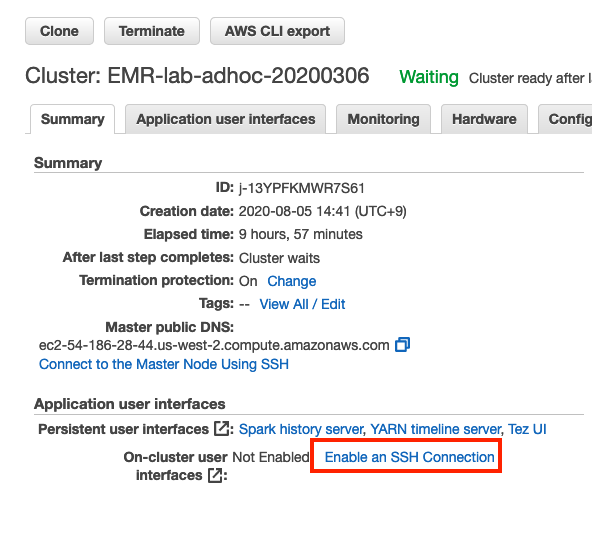
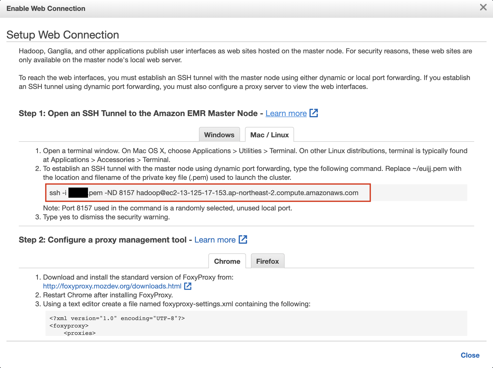
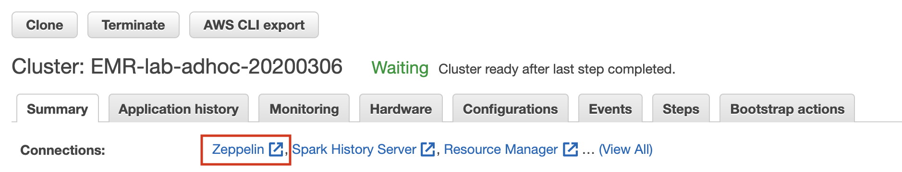
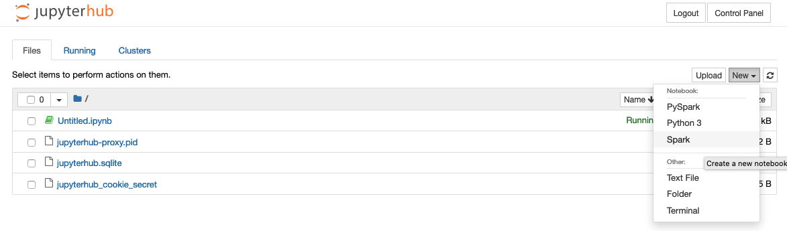
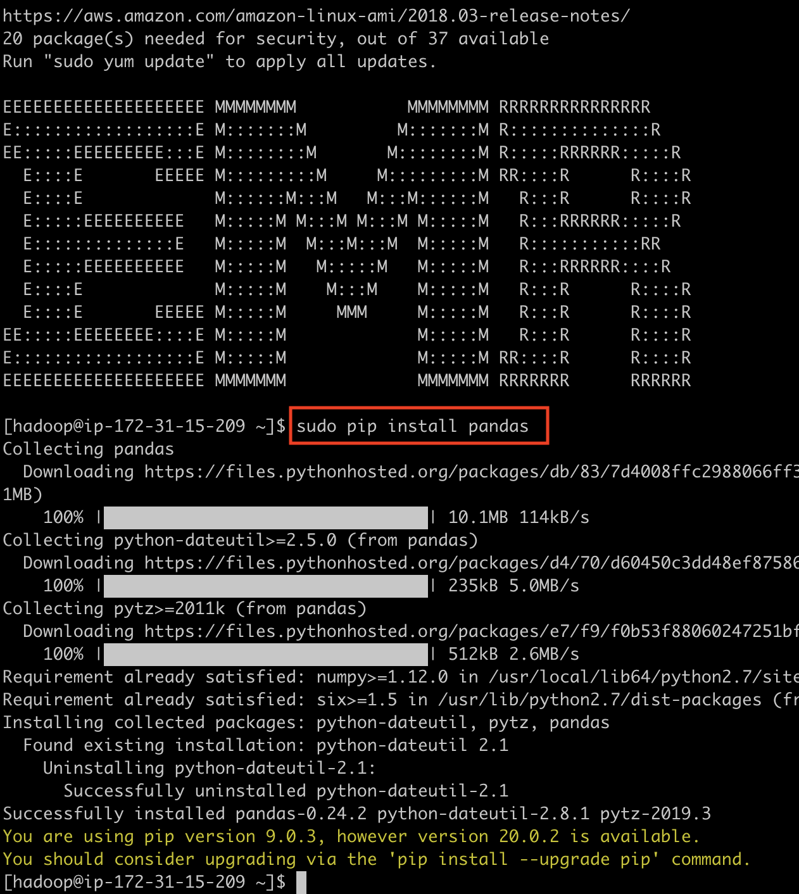
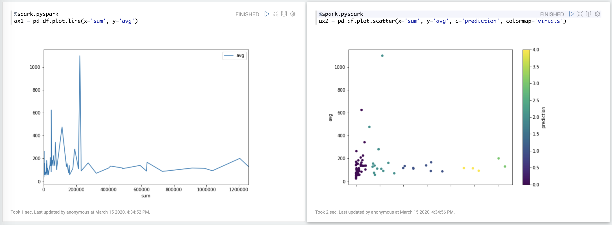

이번 실습에서는 그동안 뽑아 두었던 데이터를 응용하고 시각화하는 방법에 대해 학습합니다. 

* Zeppelin: Web-based notebook that enables data-driven, interactive data analytics and collaborative documents with SQL, Scala and more.

* Spark MLlib: MLlib is Apache Spark's scalable machine learning library.

* Pandas: pandas is a fast, powerful, flexible and easy to use open source data analysis and manipulation tool,
built on top of the Python programming language.

* Matplotlib: Matplotlib is a comprehensive library for creating static, animated, and interactive visualizations in Python.


## Table of Contents

1. Zeppelin Notebook
2. SparkMLib
3. Pandas & Matplotlib


# Zeppelin Notebook<a name="Zeppelin Notebook"></a>
---

앞서 Lab 2에서 생성한 `EMR-lab-adhoc-20200306` 클러스터는 Zeppelin을 포함하고 있습니다.
Zeppelin에 연결하기 위해 아래 지시를 따라합니다.

1. EMR 메인 페이지로 이동합니다. [link](https://ap-northeast-2.console.aws.amazon.com/elasticmapreduce/home?region=ap-northeast-2)
2. Clusters를 선택합니다.
3. `EMR-lab-adhoc-20200306` 클러스터를 선택하여 상세 페이지로 이동합니다.
4. Summary 탭의 Enable Web Connection를 클릭하여 지시 사항을 따라합니다.
그러면 Port forwarding을 통해 Zeppelin에 접속할 수 있습니다.

	FoxyProxy는 아래 링크를 참조해 주시기 바랍니다.

	[Chrome Extension](https://chrome.google.com/webstore/detail/foxyproxy-basic/dookpfaalaaappcdneeahomimbllocnb?hl=en)

	[Firefox Add-on](https://addons.mozilla.org/en-US/firefox/addon/foxyproxy-standard/)

    
	---

    
	---


5. 링크가 활성화된 Zeppelin을 클릭하여 Zeppelin 페이지로 이동합니다.

    
	---


6. 상단의 `Notebook`을 클릭하고 아래 내용을 참조하여 `Create new note`으로 노트북을 생성합니다.

    
	---

	```
	Note Name: ecommerce-clustering
	Default Interpreter: python
	```
	
# Spark MLlib<a name="Spark_Llib"></a>
	---

> 여기서는 K-means 알고리즘을 이용하여 Category를 분류(클러스터링)할 것입니다.
우리는 앞서서 카테고리별 판매 금액 총액과 평균 금액인, `category_price_sum_avg` 데이터를 미리 뽑아두었습니다.
총액과 평균 금액을 클러스터링에 적절한 feature라고 볼 수는 없지만 Spark MLlib의 간단한 실습으로는 부족하지 않습니다.
라이브러리 사용법은 [Spark MLlib K-means](https://spark.apache.org/docs/latest/ml-clustering.html#k-means)를 참조해 주시기 바랍니다.

1. 브라우저를 실행하여 이전 단계에서 생성한 Zeppelin 노트북 `ecommerce-clustering`을 엽니다.

2. Spark를 이용하여 S3에 있는 카테고리별 판매 금액 총액과 평균 금액 데이터를 확인합니다.
Notebook에서는 shift+enter를 누르면 해당 셀의 코드가 실행됩니다.

    ```python
	%spark.pyspark
	data = spark.read.format('com.databricks.spark.csv') \
	    .options(header='false', inferschema='true') \
	    .option("delimiter", ",") \
	    .load("s3://euijj-emr-lab-data-20200306/brazilian-ecommerce/category_price_sum_avg/") \
	    .cache()
	    
	data = data.filter("_c1 not like '%\N%'")
	data = data.repartition(1).withColumn('id', monotonically_increasing_id())
	data.show(100, False)


	# 데이터 시각화를 위해 최초 데이터를 저장합니다.
	data.repartition(1) \
	    .write.mode('overwrite') \
	    .option("sep","\t") \
	    .csv("s3://euijj-emr-lab-data-20200306/brazilian-ecommerce/org_clustering/")
    ```

	아래와 같은 결과물이 출력됩니다.

    ```
	+---------------------------------------------+------------------+------------------+---+
	|_c0                                          |_c1               |_c2               |id |
	+---------------------------------------------+------------------+------------------+---+
	|pcs                                          |222963.1299999999 |1098.3405418719205|0  |
	|portateis_casa_forno_e_cafe                  |47445.71000000001 |624.2856578947369 |1  |
	|eletrodomesticos_2                           |113317.73999999995|476.12495798319304|2  |
	|agro_industria_e_comercio                    |72530.46999999997 |342.1248584905659 |3  |
	|instrumentos_musicais                        |191498.87999999884|281.6159999999983 |4  |
	|eletroportateis                              |190648.57999999973|280.7784683357875 |5  |
	|portateis_cozinha_e_preparadores_de_alimentos|3968.53           |264.5686666666667 |6  |
	|telefonia_fixa                               |59583.000000000044|225.69318181818198|7  |
	|construcao_ferramentas_seguranca             |40544.52000000007 |208.99237113402097|8  |
	|relogios_presentes                           |1205005.6799999864|201.1359839759617 |9  |
	+---------------------------------------------+------------------+------------------+---+
	only showing top 10 rows
    ```

3. 위 데이터를 Spark MLlib K-means API에서 처리 가능한 데이터로 변환합니다.
변환한 데이터를 S3에 다시 저장합니다.

    ```python
	%spark.pyspark
	from pyspark.sql.functions import concat, col, lit, monotonically_increasing_id

	data = data.withColumn('f1', concat(lit('1:'),col('_c1')))
	data = data.withColumn('f2', concat(lit('2:'),col('_c2')))

	data = data.drop('_c0').drop('_c1').drop('_c2')
	data.repartition(1) \
	    .write.mode('overwrite') \
	    .option("sep"," ") \
	    .csv("s3://euijj-emr-lab-data-20200306/brazilian-ecommerce/input_clustering/")

    ```

4. K-means로 데이터를 클러스터링합니다.
아래 코드는 [Spark MLlib K-means](https://spark.apache.org/docs/latest/ml-clustering.html#k-means)에서 example 코드를 가져왔습니다.

    ```python
	%spark.pyspark
	from pyspark.ml.clustering import KMeans
	from pyspark.ml.evaluation import ClusteringEvaluator

	dataset = spark.read.format("libsvm").load("s3://euijj-emr-lab-data-20200306/brazilian-ecommerce/input_clustering/")

	# Trains a k-means model.
	kmeans = KMeans().setK(5).setSeed(1)
	model = kmeans.fit(dataset)

	# Make predictions
	predictions = model.transform(dataset)

	# Evaluate clustering by computing Silhouette score
	evaluator = ClusteringEvaluator()

	silhouette = evaluator.evaluate(predictions)
	print("Silhouette with squared euclidean distance = " + str(silhouette))

	# Shows the result.
	centers = model.clusterCenters()
	print("Cluster Centers: ")
	for center in centers:
	    print(center)
    ```

5. 결과물을 저장합니다.

    ```python
	%spark.pyspark
	predictions.drop('features').repartition(1) \
	    .write.mode('overwrite') \
	    .option("sep","\t") \
	    .csv("s3://euijj-emr-lab-data-20200306/brazilian-ecommerce/output_clustering/")
    ```

# Pandas & Matplotlib
---

위에서 뽑은 데이터를 SQL 테이블처럼 다루기 위해 Pandas를 이용하는 방법을 실습합니다.
Pandas와 Matplotlib를 이용하기 위해서는 python package를 설치해야 합니다.
EMR matster에 ssh로 연결하여 아래 명령어를 실행합니다.

```shell
subo pip install pandas
subo pip install matplotlib
```


---

1. Zeppelin에서 아래 내용을 참고하여 새 노트북을 생성합니다.

	```
	Note Name: data-visualization
	Default Interpreter: python
	```

2. spark를 이용하여 데이터를 읽어옵니다.

    ```python
    %spark.pyspark
	org = spark.read.format('com.databricks.spark.csv') \
	    .options(header='true', inferschema='true') \
	    .option("delimiter", "\t") \
	    .load("s3://euijj-emr-lab-data-20200306/brazilian-ecommerce/org_clustering/") \
	    .cache()

	output = spark.read.format('com.databricks.spark.csv') \
	    .options(header='true', inferschema='true') \
	    .option("delimiter", "\t") \
	    .load("s3://euijj-emr-lab-data-20200306/brazilian-ecommerce/output_clustering/") \
	    .cache()
    ```

3. 가져온 두 테이블을 조인하고 데이터를 확인합니다.

    ```python
	%spark.pyspark
	data = org.join(output, org.label == output.label, how='inner')
	data.show()
    ```

4. 그래프를 그리기 위해 Pandas와 Matplotlib를 import 합니다.

    ```python
	%spark.pyspark
	import matplotlib.pyplot as plt
	import pandas as pd
	import numpy as np
	pd.set_option('display.max_rows', 20)
	pd.set_option('display.max_columns', 10)
	pd.set_option('display.width', 1000)

	pd_df = data.selectExpr('category','sum','avg','prediction').toPandas()
    ```

5. 그래프를 그립니다. 하나의 셀에 하나의 그래프를 그립니다

    ```python
	%spark.pyspark
	ax1 = pd_df.plot.line(x='sum', y='avg')
    ```

    ```python
	%spark.pyspark
	ax2 = pd_df.plot.scatter(x='sum', y='avg', c='prediction', colormap='viridis')
    ```

6. 아래와 같이 셀의 크기를 조절하여 보기 쉽게 편집할 수 있습니다.

    
	---


<p align="center">
© 2020 Amazon Web Services, Inc. 또는 자회사, All rights reserved.
</p>