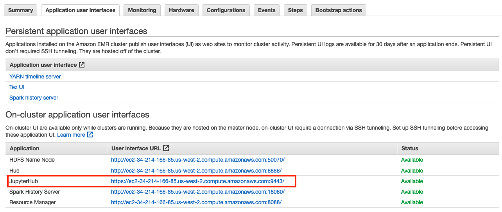

이번 실습에서는 그동안 뽑아 두었던 데이터를 응용하고 시각화하는 방법에 대해 학습합니다. 

* JupyterHub: JupyterHub brings the power of notebooks to groups of users. It gives users access to computational environments and resources without burdening the users with installation and maintenance tasks. Users - including students, researchers, and data scientists - can get their work done in their own workspaces on shared resources which can be managed efficiently by system administrators.

* Spark MLlib: MLlib is Apache Spark's scalable machine learning library.

* Pandas: pandas is a fast, powerful, flexible and easy to use open source data analysis and manipulation tool,
built on top of the Python programming language.

* Matplotlib: Matplotlib is a comprehensive library for creating static, animated, and interactive visualizations in Python.


## Table of Contents

1. JupyterHub
2. SparkMLib
3. Pandas & Matplotlib


# JupyterHub<a name="JupyterHub"></a>
---

앞서 Lab 2에서 생성한 `EMR-lab-adhoc-20200306` 클러스터는 JupyterHub를 포함하고 있습니다.
JupyterHub에 연결하기 위해 아래 지시를 따라합니다.

1. EMR 메인 페이지로 이동합니다. [link](https://ap-northeast-2.console.aws.amazon.com/elasticmapreduce/home?region=ap-northeast-2)

2. Clusters를 선택합니다.

3. `EMR-lab-adhoc-2020` 클러스터를 선택하여 상세 페이지로 이동합니다.

4. Summary 탭의 Enable Web Connection를 클릭하여 지시 사항을 따라합니다.
그러면 Port forwarding을 통해 JupyterHub에 접속할 수 있습니다.


* FoxyProxy는 아래 링크를 참조해 주시기 바랍니다.


[Chrome Extension](https://chrome.google.com/webstore/detail/foxyproxy-basic/dookpfaalaaappcdneeahomimbllocnb?hl=en)


[Firefox Add-on](https://addons.mozilla.org/en-US/firefox/addon/foxyproxy-standard/)

    
---

    
---


5. Application user interfaces 탭으로 이동하여 JupyterHub의 URL을 참고하여 접속합니다.

    
---

6. Amazon EMR의 JupyterHub에는 관리자 권한이 있는 기본 사용자가 있습니다. 사용자 이름은 jovyan이고, 암호는 jupyter입니다.


    
---


6. 우측 상단의 New를 클릭하여 `PySpark`으로 노트북을 생성합니다.

    
---

# Spark MLlib<a name="Spark_Llib"></a>
---

여기서는 K-means 알고리즘을 이용하여 Category를 분류(클러스터링)할 것입니다.
우리는 앞서서 카테고리별 판매 금액 총액과 평균 금액인, `category_price_sum_avg` 데이터를 미리 뽑아두었습니다.
총액과 평균 금액을 클러스터링에 적절한 feature라고 볼 수는 없지만 Spark MLlib의 간단한 실습으로는 부족하지 않습니다.
라이브러리 사용법은 [Spark MLlib K-means](https://spark.apache.org/docs/latest/ml-clustering.html#k-means)를 참조해 주시기 바랍니다.

1. 브라우저를 실행하여 이전 단계에서 생성한 JupyterHub 노트북을 엽니다.
각 셀에서 코드를 실행할 수 있습니다.

    
---

2. Spark를 이용하여 S3에 있는 카테고리별 판매 금액 총액과 평균 금액 데이터를 확인합니다.
Notebook에서는 shift+enter를 누르면 해당 셀의 코드가 실행됩니다.

```python
from pyspark.sql.functions import concat, col, lit, monotonically_increasing_id

# S3에 있는 데이터를 읽습니다
data = spark.read.format('com.databricks.spark.csv') \
    .options(header='false', inferschema='true') \
    .option("delimiter", ",") \
    .load("s3://euijj-emr-lab-ecommerce-2020/category_price_sum_avg/") \
    .cache()

# 데이터에 잘못된 값이 끼어 있어 제외시킵니다.
data = data.filter("_c1 not like '%\\N%'")

# 데이터의 헤더를 명명합니다.
data = data.selectExpr("_c0 as category", "_c1 as sum", "_c2 as avg")
data = data.repartition(1).withColumn('label', monotonically_increasing_id())
data.show(100, False)

data.repartition(1) \
    .write.mode('overwrite') \
    .option("sep","\t") \
    .option("header","true") \
    .csv("s3://euijj-emr-lab-ecommerce-2020/org_clustering/")
```

아래와 같은 결과물이 출력됩니다.

```
+----------------------------------------------+------------------+------------------+-----+
|category                                      |sum               |avg               |label|
+----------------------------------------------+------------------+------------------+-----+
|pcs                                           |222963.1299999999 |1098.3405418719205|0    |
|portateis_casa_forno_e_cafe                   |47445.71000000001 |624.2856578947369 |1    |
|eletrodomesticos_2                            |113317.73999999995|476.12495798319304|2    |
|agro_industria_e_comercio                     |72530.46999999997 |342.1248584905659 |3    |
|instrumentos_musicais                         |191498.87999999884|281.6159999999983 |4    |
|eletroportateis                               |190648.57999999973|280.7784683357875 |5    |
...
+----------------------------------------------+------------------+------------------+-----+
```

3. 위 데이터를 Spark MLlib K-means API에서 처리 가능한 데이터로 변환합니다.
변환한 데이터를 S3에 다시 저장합니다.

```python
# 각 피쳐를 지정합니다. 카테고리의 sum과 avg를 피쳐로 사용합니다.
data = data.withColumn('f1', concat(lit('1:'),col('sum')))
data = data.withColumn('f2', concat(lit('2:'),col('avg')))

# input data로 필요없는 컬럼은 제외하고 S3에 저장합니다.
data = data.drop('category').drop('sum').drop('avg')
data.repartition(1) \
    .write.mode('overwrite') \
    .option("sep"," ") \
    .csv("s3://euijj-emr-lab-ecommerce-2020/input_clustering/")
```

4. K-means로 데이터를 클러스터링합니다.
아래 코드는 [Spark MLlib K-means](https://spark.apache.org/docs/latest/ml-clustering.html#k-means)에서 example 코드를 가져왔습니다.

```python
from pyspark.ml.clustering import KMeans
from pyspark.ml.evaluation import ClusteringEvaluator

# 앞서 저장한 데이터를 불러옵니다.
dataset = spark.read.format("libsvm").load("s3://euijj-emr-lab-ecommerce-2020/input_clustering/")

# Trains a k-means model.
kmeans = KMeans().setK(5).setSeed(1)
model = kmeans.fit(dataset)

# Make predictions
predictions = model.transform(dataset)

# Evaluate clustering by computing Silhouette score
evaluator = ClusteringEvaluator()

silhouette = evaluator.evaluate(predictions)
print("Silhouette with squared euclidean distance = " + str(silhouette))

# Shows the result.
centers = model.clusterCenters()
print("Cluster Centers: ")
for center in centers:
    print(center)
```

5. 결과물을 저장합니다.

```python

# 추후 데이터 시각화에서 사용하기 위해 데이터를 저장합니다.
predictions.drop('features').repartition(1) \
    .write.mode('overwrite') \
    .option("sep","\t") \
    .option("header","true") \
    .csv("s3://euijj-emr-lab-ecommerce-2020/output_clustering/")
```

# Pandas & Matplotlib
---

위에서 뽑은 데이터를 SQL 테이블처럼 다루기 위해 Pandas를 이용하는 방법을 실습합니다.
Pandas와 Matplotlib를 이용하기 위해서는 python package를 설치해야 합니다.
EMR matster에 ssh로 연결하여 아래 명령어를 실행합니다.

```sh
sudo /usr/bin/pip3 install pandas
sudo /usr/bin/pip3 install matplotlib

# python 3.7에서는 아래 명령어를 사용하여 에러를 수정하세요
sudo /usr/bin/pip3 install kiwisolver==1.0.1
```

1. 아까 작업하던 JupyterHub 노트북으로 되돌아 갑니다.


2. spark를 이용하여 데이터를 읽어옵니다.

```python
org = spark.read.format('com.databricks.spark.csv') \
    .options(header='true', inferschema='true') \
    .option("delimiter", "\t") \
    .load("s3://euijj-emr-lab-ecommerce-2020/org_clustering/") \
    .cache()
    
output = spark.read.format('com.databricks.spark.csv') \
    .options(header='true', inferschema='true') \
    .option("delimiter", "\t") \
    .load("s3://euijj-emr-lab-ecommerce-2020/output_clustering/") \
    .cache()
```

3. 가져온 두 테이블을 조인하고 데이터를 확인합니다.

```python
data = org.join(output, org.label == output.label, how='inner')
data.show()
```

4. 그래프를 그리기 위해 Pandas와 Matplotlib를 import 합니다.

```python
import matplotlib.pyplot as plt
import pandas as pd
import numpy as np
pd.set_option('display.max_rows', 20)
pd.set_option('display.max_columns', 10)
pd.set_option('display.width', 1000)

pd_df = data.selectExpr('category','sum','avg','prediction').toPandas()
pd_df = pd_df.sort_values(by=['sum'])
```

5. 그래프를 그립니다. 하나의 셀에 하나의 그래프를 그립니다

```python
ax1 = pd_df.plot.line(x='sum', y='avg')
%matplot plt
```

```python
ax2 = pd_df.plot.scatter(x='sum', y='avg', c='prediction', colormap='viridis')
%matplot plt
```

6. 아래와 같이 데이터를 시각화했습니다.

    
---

    
---

<p align="center">
© 2020 Amazon Web Services, Inc. 또는 자회사, All rights reserved.
</p>