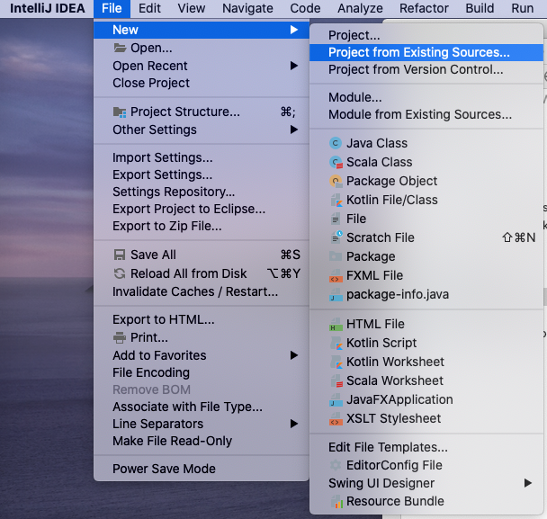
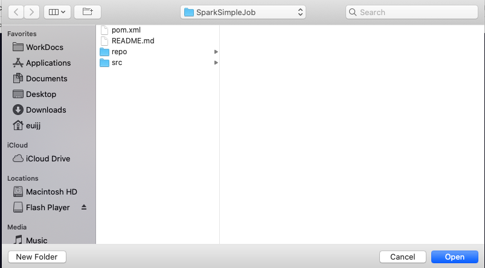
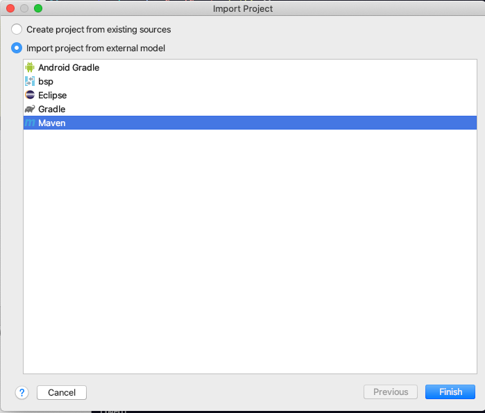
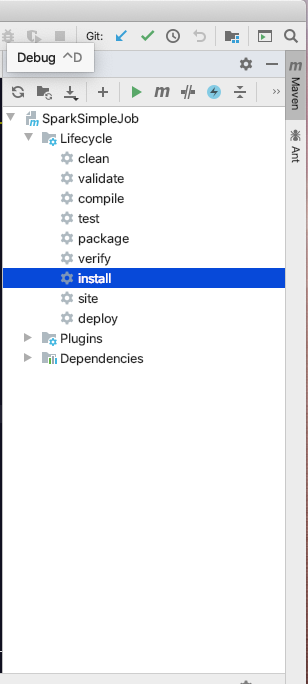
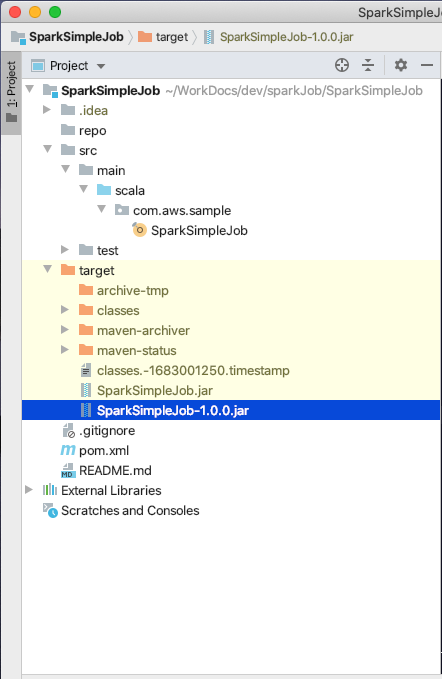

다음 실습은 MacOS 기준으로 작성 되었습니다.

이번 실습은 scala 코드로 작성한 Spark 코드를 Maven으로 compile하여 jar 파일을 생성하는 방법에 대해 알아보겠습니다.

## Table of Contents

1. 사전 준비
2. 코드 컴파일
3. jar 파일 실행하기


# 사전 준비<a name="사전_준비"></a>
---

Maven 빌딩을 위해 [IntelliJ](https://www.jetbrains.com/idea/) 소프트웨어와 아래의 플러그인이 필요합니다.

* Maven : http://maven.apache.org/
* Scala : https://plugins.jetbrains.com/plugin/1347-scala/


# 코드 컴파일<a name="코드_컴파일"></a>
---

1. 샘플 소스 코드 [SparkSimpleJob](https://github.com/elbanic/SparkSimpleJob)를 다운로드해 주십시오.

2. 'New > Project from Existing Sources...'를 선택합니다.

    
---

3. 다운로드 받은 소스 코드로 새 프로젝트를 생성합니다. 

    
---

4. 'Import project from external model'의 Maven 프로젝트를 선택합니다.

    
---

5. input용 파일을 생성합니다. 아래의 내용을 작성한 wordcount_sample.txt 이름의 text 파일을 생성해 주세요.
s3의 적절한 경로에 업로드 해주시기 바랍니다. 이 경우에는 "s3://samples-euijj/"에 업로드하였습니다.

```
Lorem Ipsum is simply dummy text of the printing and typesetting industry. Lorem Ipsum has been the industry's standard dummy text ever since the 1500s, when an unknown printer took a galley of type and scrambled it to make a type specimen book. It has survived not only five centuries, but also the leap into electronic typesetting, remaining essentially unchanged. It was popularised in the 1960s with the release of Letraset sheets containing Lorem Ipsum passages, and more recently with desktop publishing software like Aldus PageMaker including versions of Lorem Ipsum.
```

6. Spark 프로젝트 생성이 완료되면 우측 Maven plugin 창을 확장하여 install 합니다.

    
---

8. 컴파일이 완료되면 해당 프로젝트에 target 폴더가 생성되고 SparkSimpleJob-1.0.0.jar 파일이 생성된 것을 확인하십시오.

    
---


# jar 파일 실행하기<a name="jar_파일_실행하기"></a>
---

1. EMR 마스터 노드에 접속합니다.

```sh
ssh -i key.pem ec2-user@PUBLIC_DNS
```

2. SparkSimpleJob-1.0.0.jar을 업로드하여 아래의 명령어를 실행합니다.

```sh
spark-submit ./SparkSimpleJob-1.0.0.jar INPUT_PATH OUTPUT_PATH
```

3. 앞서 작성한 output 경로에 결과물이 저장된 것을 확인할 수 있습니다.


<p align="center">
© 2020 Amazon Web Services, Inc. 또는 자회사, All rights reserved.
</p>